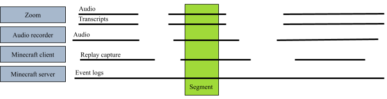
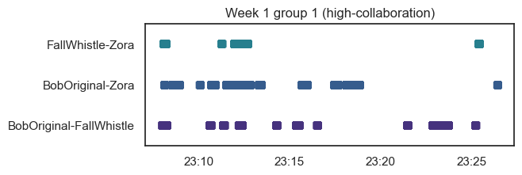

# Minecraft Analytics

This repo contains tools and configurations for analytics used in the Minecraft
Utopia research project. 

## Installation

First, ensure you have [ffmpeg](https://ffmpeg.org/), 
[ffprobe](https://ffmpeg.org/ffprobe.html), and [rollup](https://www.rollupjs.org/guide/en/) installed.

This repository has a submodule, the [data repo](https://github.com/cproctor/minecraft-utopia-data). 
When you clone this repo, use `--recurse-submodules` to also check out the
submodule. If you already have this repo cloned, you can initialize and fetch
the submodule with the following commands:

```
$ cd data
$ git submodule init
$ git submodule update
```

*Minecraft Analytics* uses [poetry](https://python-poetry.org/) for dependency
management. After installing poetry, run `poetry install` to install
dependencies and then run `poetry shell` to enter a shell with
a properly-configured path able to access these dependencies. `exit` from the
shell back to your prior shell when finished. 

You will need to update some settings in `invoke.yaml` for your local
environment.

## Running tasks

*Minecraft Analytics* uses [invoke](https://www.pyinvoke.org/) to define and run
tasks. Run `inv --list` to see available tasks and `inv --help <taskname>` for
help on a specific task.

### Getting started

Here's an example of basic usage. In the example below, we sync log files to the
local machine, then resample events by grouping all events per minute, and then
find the player's mean location for each minute. (`NaN` stands for "not a
number"; these values are for periods in which there were no logged events and
it was therefore impossible to calculate a mean.)

```
$ inv sync --world logtest --interact
>>> df
...
>>> loc_cols = [c for c in df.columns if c.startswith('location')]
>>> df[loc_cols].resample('min').mean()
                     location_x  location_y  location_z
timestamp                                              
2021-06-26 19:28:00    5.567797   65.677966  211.813559
2021-06-26 19:29:00         NaN         NaN         NaN
2021-06-26 19:30:00         NaN         NaN         NaN
...                         ...         ...         ...
2021-06-26 20:33:00   40.317972   68.631336  203.539171
2021-06-26 20:34:00   34.492823   67.470494  202.722488
2021-06-26 20:35:00   49.631313   65.315657  218.717172
```

## Architecture

The top-level directories in this repo are:

- **analysis**: Code for producing specific analyses. Most of the work should be
  done by code imported from `lib`.
- **data**: The [Minecraft Utopia submodule](https://github.com/cproctor/minecraft-utopia-data). 
  All personally-identifiable information (including downstream analysis
  products which have not been de-identified) must be contained within this
  repo.
- **export**: Location to store reproducible results of analysis, such as
  figures and tables. Not part of the repo, but will be created as needed.
- **participants**: Documents meant for participants, such as set-up instructions
- **lib**: All generalizable source code lives here. 
- **server**: Code meant for deployment on the server, such as configuration files
- **tasks**: Definitions of [invoke](http://www.pyinvoke.org/) tasks, this package's
  high-level API.
- **tutorial**: Space for stuff meant for team members' learning.

## Usage

This package is concerned with three main concepts: **segments**, **products**, and 
**analyses**.

A **segment** is defined as a time span bounded by two UTC timestamps, cutting across 
multiple streams of data, such as back-end logs from the Minecraft server, videos of 
gameplay from screen capture or Minecraft Replay, video and audio streams from Zoom, 
transcripts, etc. When you specify the timestamp bounds of a segment, this package
provides slices of all the cata streams corresponding to the segment. 



A **product** is defined as a transformation of data streams within a segment into 
a desired representation. For example, `SegmentVideo` interleaves a video of gameplay
with an audio source, so that we can watch in-game activity while hearing players' speech.
Other products are more abstract: `SegmentJointAttention` uses server logs of players' 
positions and gaze vectors to calculate and plot joint visual attention (see Proctor & Muller, 2022),
as shown below.



Finally, an **analysis** performs a calculation with one or more products. For example, each of the 
research questions in Proctor & Muller (2022) is implemented as an analysis.
The parameters for products and analyses are specified in yaml files. 

## TODO

- In the simulation product:
  - Develop a UI with a playhead, allowing scrubbing across time
  - Add an annotation layer for qualitative coding
  - Add audio layer
  - Add a transcript layer with a plumbob, and possibly sidebar transcript.
  - Add JVA layer
- In the task definitions: 
  - Only import what's needed for each task. 

## References

Proctor, C. & Muller, D. (2022). Joint visual attention and collaboration in Minecraft. In A. Weinberger, W. Chen, D. Hernández-Leo, & B. Chen (Eds.). (2022). *Proceedings of the 15th International Conference on Computer-Supported Collaborative Learning - CSCL 2022*. (pp. 226-233). Hiroshima, Japan: International Society of the Learning Sciences. (Best paper nomination. 46% accepted.)

Proctor, C. & Mawer, D. (2023). MultiMod: A platform for qualitative analysis of multimodal learning
analytics. In *Building knowledge and sustaining our community, Proceedings of the 16th International Conference on Computer-Supported Collaborative Learning - CSCL 2023.* Montreal, Canada: International Society of the Learning Sciences.
